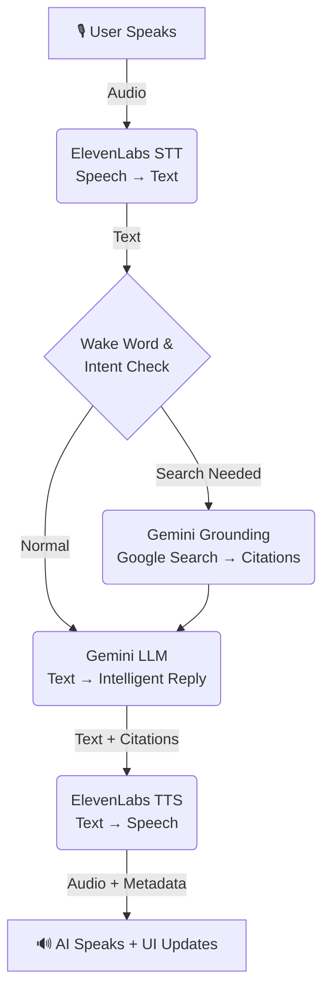

# Echo: Premium Voice Agent

A real-time, bidirectional voice interaction agent that combines the power of **Google Gemini 2.5 Flash** for intelligence and **ElevenLabs** for realistic speech synthesis and recognition. The system features a **premium minimalist UI** with organic animations and a **Privacy First** architecture.

## Features

- **Privacy First**: Zero log storage. Interactions are processed in-memory and not persisted to disk.
- **Premium Minimalist UI**: Built with a focus on aesthetics, featuring **glassmorphism**, dynamic state animations, and organic motion.
- **Dynamic Theme Customization**: 4 premium predefined themes (**Snow**, **Midnight**, **Minimal**, **Titanium**) with "Minimal" as the core default.
- **Real-time Audio Streaming**: Low-latency bidirectional audio communication via WebSockets.
- **Advanced Speech-to-Text (STT)**: Utilizes **ElevenLabs Scribe** model for accurate speech recognition.
- **Intelligent LLM Processing**: Powered by **Google Gemini 2.5 Flash** for fast, context-aware, and multimodal responses.
- **Grounded Responses**: Uses Gemini's built-in **Grounding with Google Search** to provide up-to-date information (news, weather, stocks) with source citations.
- **Natural Text-to-Speech (TTS)**: Generates lifelike speech using **ElevenLabs** (defaults to `eleven_multilingual_v2`).
- **Modern Frontend Stack**: Powered by **Next.js 16**, **React 19**, and **TailwindCSS v4**.

## Tech Stack

### Backend

- **Language**: Python 3.8+
- **Framework**: FastAPI (Async Web Framework)
- **AI Services**:
  - **LLM**: Google Gemini 2.5 Flash (with Grounding)
  - **Voice**: ElevenLabs (Scribe v1 for STT, Multilingual v2 for TTS)
- **Utilities**: Pydantic, HTTPX, Python-Dotenv

### Frontend

- **Framework**: Next.js 16.0.7 (App Router)
- **Language**: TypeScript
- **Styling**: TailwindCSS v4
- **Animations**: Framer Motion 12
- **State Management**: React Hooks (useState, useEffect)

## Folder Structure

```
Voice-agent/
├── backend/                  # Python FastAPI Backend
│   ├── app/                  # Application Source Code
│   │   ├── routers/          # API Route Handlers (voice)
│   │   ├── services/         # Business Logic (Gemini, Weather, News, Search)
│   │   ├── utils/            # Helper Functions (Language Detector)
│   │   ├── config.py         # Environment Configuration
│   │   ├── main.py           # App Entry Point & WebSocket Handler
│   │   └── prompts.py        # System Prompts
│   ├── .env                  # Environment Variables
│   └── requirements.txt      # Python Dependencies
│
├── frontend/                 # Next.js Frontend
│   ├── app/                  # App Router Pages & Layouts
│   │   ├── globals.css       # Global Styles
│   │   └── page.tsx          # Home Page (Theme & State management)
│   ├── components/           # React Components
│   │   ├── VoiceAssistant.tsx  # Interactive Mic UI
│   │   └── WaveAnimation.tsx   # Organic sound visualizer
│   ├── hooks/                # Custom React Hooks
│   │   └── useVoiceAssistant.ts # Core logic for voice interactions
│   ├── lib/                  # Utilities (API helpers)
│   ├── types.d.ts            # TypeScript definitions
│   ├── public/               # Static Assets
│   └── package.json          # Node.js Dependencies
│
└── README.md                 # Project Documentation
```

## How It Works

The application operates on a client-server architecture using WebSockets for real-time communication.



1.  **Connection**: The frontend establishes a WebSocket connection to `ws://localhost:8000/ws/audio-stream`.
2.  **Audio Capture**: The user's microphone input is captured in chunks using the MediaRecorder API in the browser.
3.  **Streaming**: These audio chunks are base64-encoded and streamed instantly to the backend.
4.  **Processing Pipeline** (Backend):
    - **Speech-to-Text (STT)**: `ElevenLabsClient` converts the incoming audio stream to text using the Scribe model.
    - **Intent Analysis**: The system checks if the user's query requires real-time data (e.g., "latest news").
    - **Intelligence & Grounding**: `GeminiClient` generates a response. If real-time data is needed, it uses the **Google Search tool** to fetch grounded information and citations.
    - **Text-to-Speech (TTS)**: `ElevenLabsClient` converts the LLM's text response back into audio.
5.  **Response**: The backend sends a JSON payload containing the transcript, the AI's text reply, **citations/grounding metadata**, and the generated audio (base64).
6.  **Playback**: The frontend receives the payload, displays the chat message **with citations**, and queues the audio for seamless playback.

## Prerequisites

- **Python**: 3.8 or higher
- **Node.js**: 18 or higher
- **npm** or **yarn**
- **API Keys**:
  - [ElevenLabs API Key](https://elevenlabs.io/)
  - [Google Gemini API Key](https://aistudio.google.com/)
  - [OpenWeather API Key](https://openweathermap.org/api)
  - [SerpApi Key](https://serpapi.com/)

## Installation & Setup

### Backend

1.  Navigate to the backend directory:

    ```bash
    cd backend
    ```

2.  Create and activate a virtual environment:

    ```bash
    python -m venv .venv
    # Windows
    .venv\Scripts\activate
    # macOS/Linux
    source .venv/bin/activate
    ```

3.  Install dependencies:

    ```bash
    pip install -r requirements.txt
    ```

4.  Configure Environment Variables:
    Create a `.env` file in `backend/` with the following:
    ```env
    GOOGLE_API_KEY=your_gemini_key
    ELEVENLABS_API_KEY=your_elevenlabs_key
    OPENWEATHER_API_KEY=your_openweather_key
    SERPAPI_API_KEY=your_serpapi_key
    ```

### Frontend

1.  Navigate to the frontend directory:

    ```bash
    cd frontend
    ```

2.  Install dependencies:

    ```bash
    npm install
    ```

3.  Configure Environment Variables:
    Create a `.env` file in `frontend/`:
    ```env
    NEXT_PUBLIC_API_BASE_URL=http://localhost:8000
    ```

## Running the Application

1.  **Start the Backend**:

    ```bash
    # In backend/ (.venv activated)
    uvicorn app.main:app --reload
    ```

2.  **Start the Frontend**:

    ```bash
    # In frontend/
    npm run dev
    ```

3.  Open `http://localhost:3000` to use the Voice Agent.

---

Powered by [M37 Labs](https://m37labs.com)


